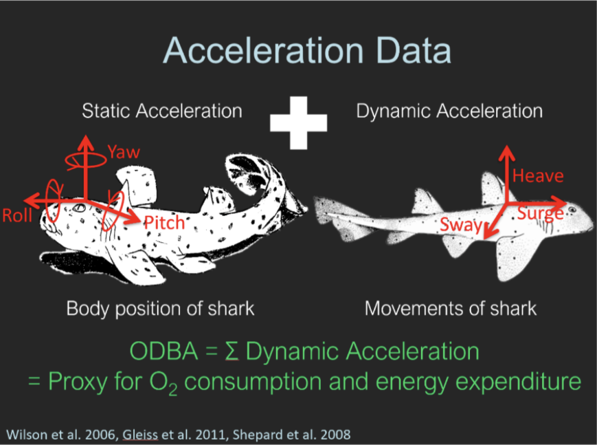

<!-- To be able to have continuous line numbers -->
```{=html}
<style>
body
  { counter-reset: source-line 0; }
pre.numberSource code
  { counter-reset: none; }
</style>
```

```{r setup, include=FALSE}
knitr::opts_chunk$set(echo = TRUE)
knitr::opts_chunk$set(warning = FALSE)
knitr::opts_chunk$set(cache = TRUE)
knitr::opts_chunk$set(message = FALSE)
```


# Tutorial objectives


The aim of this tutorial is to delve into the process of fitting hidden Markov models (HMMs) to accelerometer data, integrating covariates into transition probabilities, and employing a classic model selection criterion to choose the most suitable model from a set of candidates. For all of this procedures, we will be using the R package `MomentuHMM`, introduced in first part of this workshop series. 

The primary learning objectives in this first tutorial are to:

  - Fit a basic HMM to accelerometer data
  - incorporating and interpreting covariates on behaviour transition probabilities
  - visualizing the Depth time series with decoded states


<!-- The goal of this tutorial is to explore how to fit hidden Markov models to accelerometer data, incorporate covariates into the transition probabilities, and use a classic model selection criteria to select the "best" model out of different candidates. -->

<!-- The goal of this tutorial is to explore fitting hidden Markov models to accelerometer data, incorporate covariates into the transition probabilities, and select for the best candidate model. We use 4 days of acceleration data obtained from a free-ranging blacktip reef shark at Palmyra Atoll in the central Pacific Ocean (data taken from Leos-Barajas et al. 2017). Specificly, the following topics wil be covered throughout this tutorial: -->

  <!-- - Resampling data (Down sampling) (???) -->


# Accelerometer data

Accelerometer devices measure up to three axes, which can be described relative to the body of the animal: longitudinal (surge), lateral (sway) and dorsoventral (heave). These devices are becoming more prevalent in the fields of animal biologging data as they provide a means of measuring activity in a meaningful and quantitative way. From tri-axial acceleration data, we can also derive several measures that summarize effort or exertion and relate acceleration  to activity levels such as overall dynamic body acceleration (ODBA) and vectorial dynamic body acceleration (VeDBA).

```{r,fig.align='center',echo=F}




```

ODBA and VeDBA can be used to reduce the dimensionality of three-dimension acceleration data while retaining important information. Further, because acceleration data is often at high temporal resolutions over time, it also naturally exhibits a large degree of autocorrelation, making it impossible to assume independence between sequential observations. HMMs can account for the autocorrelation present in the data while assuming that the data were generated according to a finite set of (unobserved) behaviors making them a good candidate model for this type of data structure.

## Blacktip Reef Shark data

In this tutorial, we will be analyzing four days' worth of acceleration data from a free-ranging blacktip reef shark in the Palmyra Atoll located in the central Pacific Ocean. The acceleration data was collected from a 117-cm female shark (*Carcharhinus melanopterus*) species using a multisensor package. This package was attached to the shark's dorsal fin and recorded three-dimensional acceleration data at a rate of 20 Hz. It also recorded depth and water temperature at a rate of 1 Hz. After four days, the package, which was equipped with a VHF transmitter, detached from the shark and could be retrieved from the water surface (Papastamatiou et al. 2015). To assess the shark's active behavior, the authors calculated the average ODBA over 1-second intervals, resulting in a dataset comprising 320,214 observations. Consequently, the variables in the dataset consist of time of day, water temperature (in Celsius), depth (in meters), and ODBA.

<!-- In this tutorial, we will work with four days of acceleration data gathered from a free-ranging blacktip reef shark at Palmyra Atoll in the central Pacific Ocean. Acceleormetry data was obtained from a free-ranging blacktip reef shark (*Carcharhinus melanopterus*) at Palmyra Atoll in the central Pacific Ocean (data taken from Leos-Barajas et al. 2017). A multisensor package was attached to the dorsal fin of a 117-cm female shark. The multisensor data-logger recorded three-dimensional acceleration (at 20 Hz), depth and water temperature (at 1 Hz) and was embedded in a foam float which detached from the shark after 4 days (Papastamatiou et al. 2015). The package also contained a VHF transmitter allowing recovery at the surface -->
<!-- after detachment. In order to examine active behaviour, the average ODBA of the shark over 1-second intervals was calculated. This resulted in 321 815 observations. As a result, the variables for the dataset are the time of day, water temperature, depth (in meters) and the ODBA. -->

```{r}
# R packages that will be used for this tutorial
library(readr)
library(momentuHMM)
library(ggplot2)
library(dplyr)
library(lubridate)


# Load data 
BlacktipB <- read_delim("BlacktipB.txt", 
                        delim = "\t", escape_double = FALSE, 
                        trim_ws = TRUE)

```

```{r}
head(BlacktipB)
```

**Mention something about missing data, and since we're taking the 1-minute average, we don't have to worry about irregular emissions. But this didn't exist since the beginning**

## Data processing 

Looking at the ODBA values throughout the observed period, we find ODBA is unusually high at some times -- for this shark we assumed that values between 0 and 2 were consistent with what we expected. The dashed blue line in the plot below corresponds to a ODBA value of 2, so those values that are above this line correspond to these high ODBA values throught the observed time period:

```{r, fig.height= 4, fig.width=12,echo=T}

BlacktipB_aux = BlacktipB %>% 
  mutate(Time = as.POSIXct(Time,format = "%m/%d/%Y %H:%M")) 

BlacktipB_aux %>% 
  ggplot(aes(Time,ODBA)) + 
  geom_line() + geom_hline(yintercept = 2,linetype="dashed",color="blue")
```

Because accommodating extreme values can pose a problem for identification of an adequate state-dependent distribution in our HMM, we removed them from the data set. However, note that in general, deciding whether to remove extreme values or not will more likely depend on whether we find appropriate distributional forms that can accommodate them. Generally, we need to make sure that extreme values are in fact some artefact of the data collection process, not representative of a behavior of interest, or inconsistent with what we are trying to capture as well. Removing data is not good general practice but instead we can assess on a case-by-case basis. Aditionally, for the interest of time, **in this tutorial we will be working with the 1-minute average depth, temperature and ODBA values** -- this decrease significantly the amount of time required for the model fitting stage. As well, we will process the Time variable in order to have a datetime format.

**Maybe mention something about the time resoultion choice -- contemporaneous independence assumption**

```{r}

# Transform into proper time format and take 1-min avg
BlacktipB_1min = BlacktipB %>% filter(ODBA <= 2) %>%  
  mutate(Time = as.POSIXct(Time,format = "%m/%d/%Y %H:%M")) %>% 
  group_by(Time = cut(Time, breaks = "1 min")) %>%
  summarise(ODBA_avg = mean(ODBA),
            temp_avg = mean(Temp),
            depth_avg = mean(Depth)) %>%
  ungroup() %>%
  mutate(Time = as.POSIXct(Time,format = "%Y-%m-%d %H:%M:%S")) %>%
  as.data.frame()
  
head(BlacktipB_1min)
```


After transforming the data, we now observe the 1-minute average ODBA time series across the four days in the plot below. The horizontal red lines provide a visual reference for what might represent the mean of two potential behaviors. These behaviors could be attributed to "low-activity" (for the lower values) and "high-activity" (associated with relatively higher values).Therefore, we can start proposing the model fitting with two behavioural states. It's important to note that there are no occurrences at zero, as the purple horizontal line corresponds to the y-intercept where $y=0$.


```{r,echo=T, fig.height= 4, fig.width=12}
BlacktipB_1min %>% 
  ggplot(aes(Time,ODBA_avg)) + 
  geom_line()  + geom_hline(yintercept = .05, color = "red") +
    geom_hline(yintercept = .09, color = "red") +
  geom_hline(yintercept = 0, color = "purple")

```

Now, according to the histogram of the observations associated to the ODBA values, the distribution suggest that a gamma distribution could be appropiate to model the data stream. This is reforced by the fact that we don't have zero occurrences in this data stream, as can be visualized in the ODBA time series plot.

```{r, echo=T}
hist(BlacktipB_1min$ODBA_avg, 
     breaks = 80, 
     main="Histogram of ODBA", 
     xlab = "ODBA")
```


After selecting a data resolution and selecting a number of behaviour states, we are ready to start proposing candidate models for this data!

# Model fitting

The best way to start when fitting a hidden Markov model is to moving from simple models to more complex ones. It's important to remember that when fitting a hidden Markov model, we must specify two key components:

  - Number of behavioural (hidden) states
  - State-dependent distributions
  
From the latter, it's important to to emphasize a significant assumption being made: the contemporaneous conditional independence assumption. The assumption states that, if $\{ X_t \}$ is the observed process and $\{ S_t \}$ is the behavioural process, for every time $t$, the data streams are independent conditional on the hidden states. This can be mathematically expressed as follows:

$$ f(\boldsymbol{x_{t}} \mid S_{t} = s_{t}) = \prod_{p=1}^P f(x_{tp} \mid S_{t} = s_{t}),$$

where $\boldsymbol{x_t} = (x_{t1},x_{t2},\ldots, x_{tP})$ represents the set of observations associated with the data streams at time $t$. For the current modeling procedure, we're dealing with a special case, since we only have one data stream. In this case, the contemporaneuous conditional independence assumption is not necessary. However, in other scenarios where the observation process includes two or more data streams, which is often the case (for instance, step length and step angle), this assumption becomes crucial, as it enables the modeling of each data stream.


Finally, for this model fitting stage, no additonal data will be incorporated in the state-switching dynamics -- which translates in not including covariances in the transition probabilities allocated in the transition probability matrix. As part of the data preparation, we need to process the data using the `prepData` function, which will assign the class `momentuHMMData` to our dataframe. This will allow us to use the functions provided by `momentuHMM`. Since we're not using coordinate variables to transform them into step lengths, we need to seet the parameter coordNames to `NULL`.

```{r}
BlacktipBData = prepData(BlacktipB_1min,coordNames = NULL)
```

The function `fitHMM` allow us to fit the model we have in mind. To perform model fitting as intended, we need to provide several arguments. The argument `nbStates` is used to specify the number of states we are assuming. In this case, we are working with two states. The argument `stateNames` is optional; it allows us to assign names to the behavioral states. In this case, we are going to name the hidden states as "low-activity" (state 1) and "high-activity" (state 2). The `dist` argument is used to indicate how we are modeling each of the observed data streams. In our case, this is only the ODBA values. We will model this as gamma distribution, following the earlier EDA. Moreover, when dealing with a gamma distribution for modeling observations, the standard parametrization typically involves the shape (usually denoted as $\alpha$) and rate (usually denoted as $\beta$) parameters. However, `fitHMM` employs the mean and standard deviation parameters instead of the shape and rate. For the choice of initial parameter values, we can use the insights gained from the previous EDA. Based on the plots presented above, setting mean values of 5 and 9 for low-activity and high-activity behaviors, respectively, for our state-dependent distributions seems to be a reasonable choice. We store these assigned initial values in the vectors `mu0` for the mean and `sigma0` for the standard deviation. Finally, the `par0` argument requires a list of the initial values for the state-dependent distribution parameters as input.

```{r, cache=TRUE}
stateNames = c("low-activity","high-activity") # define names for each state
mu0 = c(.05,.09) # initial values for the mean of each behavioural state
sigma0 = c(.02,.02) # initial values for the standard deviation of each behavioural state
fit1 = fitHMM(BlacktipBData,
              nbStates=2,
              stateNames = stateNames,
              dist=list(ODBA_avg="gamma"),
              Par0 = list(ODBA_avg=c(mu0,sigma0)))

fit1
```


Note that the value of the maximum log-likelihood is positive, which may seem unusual, as maximum likelihood values are typically negative. This positive value suggests that the likelihood surface contains very prominent peaks. Maybe data transformation can provide some insight about what's going on with this inusual log-likelihood value. We can make use of the following property of the Gamma distribution: if $X  \sim Gamma(\alpha,\beta)$, then $cX  \sim Gamma(\alpha,\beta/c)$. Consequently, by scaling our observations up to a constant factor, the estimated parameters should correspond to those of the original data adjusted for the scaling factor. Therefore, if we attempt to fit the same model with a data transformation for the ODBA values, we should obtain identical parameter estimations, except for the scaled parameters. In this case, we chose $c=100$ as the scale factor. 

<!-- since the mean is $\alpha/\beta$ and the standard deviation is given by $\sqrt{\alpha}/\beta$, we have that the mean and standard deviaton for $cX$ would be $\alpha/(\beta/c) = c (\alpha/\beta) $ and  $\sqrt{\alpha}/(\beta / c) = c \sqrt{\alpha}$ $/ (\beta / c) = c \sqrt{\alpha}/\beta $. In other words -->

```{r, cache=TRUE}
c=100
BlacktipB_1min$cODBA_avg = c*BlacktipB_1min$ODBA_avg
BlacktipBData = prepData(BlacktipB_1min,coordNames = NULL)
cmu0 = c*mu0 # initial values for the mean of each behavioural state
csigma0 = c*sigma0 # initial values for the standard deviation of each behavioural state
cfit1 = fitHMM(BlacktipBData,
              nbStates=2,
              stateNames = stateNames,
              dist=list(cODBA_avg="gamma"),
              Par0 = list(cODBA_avg=c(cmu0,csigma0)))

cfit1
```

As expected, the estimates for the mean and the standard deviaton are the same (up to the scale factor), and all the other estimates, transtition probabilities and initial state distribution remain the same! However, note that the maximum log-likelihood is different. In this case, transforming the observed values results in 'flattening' the likelihood surface, but global and local maximas remain the same, therefore we have the same parameter estimates for the transition probabilities and initial state distribution. For the rest of this tutorial, we will be modelling the scaled 1-minute average ODBA values.

```{r}

# Negative log-likelihood 
list(original_ODBA = fit1$mod$minimum, scaled_ODBA = cfit1$mod$minimum)

# Parameter estimates for state-dependent distribution related to the ODBA data stream 
list(original_ODBA = fit1$mle$ODBA_avg, scaled_ODBA = cfit1$mle$cODBA_avg)

# Parameter estimates the initial state distribution 
list(original_ODBA = fit1$mle$delta, scaled_ODBA = cfit1$mle$delta)

# Parameter estimates for the transtition probabilities
list(original_ODBA = fit1$mle$gamma, scaled_ODBA = cfit1$mle$gamma)

```

Using the `plot` flunction, we can visualize the state-dependent distributions using the estimated parameters. The plot below provides a depiction of low-activity and high-activity behaviors. In this visualization, the low-activity distribution exhibits higher density closer to zero, while the high-activity behavior shifts its probability mass towards higher (scaled) 1-minute average ODBA values.

```{r}
plot(cfit1,breaks = 80)
```

Let's examine the pseudo-residuals. By using the `plotPR` function, we can visualize these pseudo-residuals. This function displays the pseudo-residual time series, qq-plots, and autocorrelation functions (ACF). It's important to note that pseudo-residuals are a specific type of model residuals that consider the interdependence of observations. Pseudo-residuals are computed for each data stream, and in our case, we are only considering ODBA values, resulting in a single plot of pseudo-residuals. It's worth remembering that when the fitted model is appropriate, the pseudo-residuals should adhere to a standard normal distribution. However, based on the following plots, it appears that the model doesn't fit well for high (scaled) ODBA values. Furthermore, the ACF plot indicates a significant autocorrelation between observations in the (scaled) ODBA time series, suggesting that the model fails to capture this autocorrelation. Notably, there is a substantial level of autocorrelation and some deviation from normality.


```{r, fig.height= 4, fig.width=12}
plotPR(cfit1)
```

We can also compute the most probable sequence of states. As previously mentioned, the parameter estimates for transition probabilities and initial state distribution remain consistent for both the original ODBA stream and the scaled ODBA stream, resulting in identical sequences of states.

```{r, fig.height= 6, fig.width=12,cache=TRUE}
# identify most likely state using the Viterbi algorithm
BlacktipB_1min$state <- factor(viterbi(fit1))

# proportion of the behaviour states during the observed period
table(BlacktipB_1min$state)/length(BlacktipB_1min$state)

BlacktipB_1min %>% mutate(day = day(Time)) %>%
  ggplot(aes(Time,ODBA_avg)) +
  #facet_wrap(~day,scales = "free_x") +
  geom_line(alpha=.1) +
  geom_point(aes(shape=state,color=state)) + ylab("ODBA (1-min average)")

```

```{r, fig.height= 6, fig.width=12,cache=TRUE}
# identify most likely state using the Viterbi algorithm (scaled ODBA)
BlacktipB_1min$cstate <- factor(viterbi(cfit1))

# proportion of the behaviour states during the observed period
table(BlacktipB_1min$cstate)/length(BlacktipB_1min$cstate)

BlacktipB_1min %>% mutate(day = day(Time)) %>%
  ggplot(aes(Time,cODBA_avg)) +
  #facet_wrap(~day,scales = "free_x") +
  geom_line(alpha=.1) +
  geom_point(aes(shape=cstate,color=cstate)) + ylab("10*ODBA (1-min average)")

```


<!-- One key step when fitting models is to confirm whether the parameter estimates correspond to the actual MLE (global maximum). HMMs can be sensitive to initial values, so a procedure to check if the estimations are reliable are needed. The argument `retryFits` indicates how many times initial values are jittered and after that, model fitting is done. Here, we try to refit the model 10 times, in order to see we found the global maximum. This can take time to run. -->

An essential stage in model fitting is to verify if the parameter estimates correspond to the actual Maximum Likelihood Estimation (MLE). HMMs can be susceptible to initial values, so we need a procedure to assess the reliability of the parameter estimates. The argument `retryFits` in `fitHMM` specifies the number of times initial values are perturbed before model fitting takes place. Here, we attempt to refit the model 10 times to assess whether we have identified the global maximum. This can take time to run.

```{r, cache=TRUE}
set.seed(147)
fit1_s2 <- fitHMM(BlacktipBData,
                  nbState = 2,
                  stateNames = stateNames,
                  dist=list(cODBA_avg="gamma"),
                  Par0 = list(cODBA_avg=c(cmu0,csigma0)),
                  retryFits=10)
fit1_s2
```

Seems nothing changed at all!

Let's go further by introducing a high perturbation to the initial values. Specifically, instead of 5 and 9, we will use 0.1 and 100 for the mean parameters. Additionally, for the initial values related to the standard deviation, we will set them at 100 for each state-dependent distribution. It's important to emphasize that regardless of the initial values, the coefficients should be the same. Indeed, we can observe that the estimated coefficients and log-likelihood values are still similar.

```{r, cache=TRUE}
mu1 = c*c(.001,1)
sigma1 = c*c(1,1)

fit1_s2_long <- fitHMM(BlacktipBData,
                  nbState = 2,
                  stateNames = stateNames,
                  dist=list(cODBA_avg="gamma"),
                  Par0 = list(cODBA_avg=c(mu1,sigma1)))

fit1_s2_long
```

Finally, we try a different set of initial values such that these are close to each other. Specifically, for the mean parameters, we provide values that are closer. Even when doing this, the outcome is consistent with the same model fitting, signifying that our inference process is robust. In this case, the parameter estimates remain unchanged except for one significant change: the states have swapped. In other words, the parameter initially associated with state 1 has now shifted to state 2, and vice versa. Consequently, everything has transitioned to the location of the other state, while otherwise remaining unaltered.

```{r, cache=TRUE}
mu2 = c*c(.04,.06) # This gives 4 and 6 as initial values for estimating the mean parameters 
sigma2 = c*c(.02,.02) # This gives 2 and 2 as initial values for estimating the mean parameters

fit1_s3 <- fitHMM(BlacktipBData,
                  nbState = 2,
                  dist=list(cODBA_avg="gamma"),
                  Par0 = list(cODBA_avg=c(mu2,sigma2)))

fit1_s3
```

By employing the `plotPR` function, we can observe that the pseudo-residuals remained consistent, despite the state parameter switching.

```{r, fig.height= 4, fig.width=12}
plotPR(fit1_s2_long)
```

When calculating the most likely sequence of states (Viterbi sequence), it's noticeable that the values have been reversed. This is due to the model fitting associating state 1 with "high-activity" behavior and state 2 with "low-activity" behavior.

```{r, fig.height= 6, fig.width=12}
# identify most likely state using the Viterbi algorithm
BlacktipB_1min$state_wildPar0 <- factor(viterbi(fit1_s2_long))

# proportion of the behaviour states during the observed period
table(BlacktipB_1min$state_wildPar0)/length(BlacktipB_1min$state_wildPar0)

# BlacktipB_1min %>% mutate(day = day(Time)) %>% 
#   ggplot(aes(Time,state_wildPar0)) + facet_wrap(~day) + geom_point()

BlacktipB_1min %>% mutate(day = day(Time)) %>%
  ggplot(aes(Time,ODBA_avg)) +
  #facet_wrap(~day,scales = "free_x") +
  geom_line(alpha=.1) +
  geom_point(aes(shape=state_wildPar0,color=state_wildPar0))


```


During the model fitting process, we pointed out the absence of covariates in the transition probabilities. Additionally, the ACF plot indicated a high autocorrelation between observations that the model failed to capture. Perhaps by considering the inclusion of other data streams, we could potentially reduce this autocorrelation. To explore this, we can investigate the incorporation of covariates into the state-switching dynamics to observe the potential outcomes.


# Incorporating covariates

As in Leos-Barajas et al. 2017, we can incorporate additional information that may help explain the ODBA values. In this context, we are considering the minute of the day for each observation. To represent time of day, we utilize two trigonometric functions with a 24-hour period: $cos(2\pi (t/60)/24)$ and $sin(2\pi (t/60)/24)$. Using the `cosinor` function, we can transform our data stream into a format that is suitable for analysis. As well, we need to provide the formula corresponding to the regression that will be stored in the transition probability values. We will fit two models while taking these factors into account, one using the original 1-minute average ODBA data stream and the other using the scaled version. 


```{r, cache=TRUE}

BlacktipB_1min = BlacktipB_1min %>%   
  mutate(min_day = time_length(hm(format(Time,format = "%H:%M")),unit = "minutes"))


BlacktipBData = prepData(BlacktipB_1min,coordNames = NULL, covNames = c("min_day"))

# re-fit model 1
fit1 = fitHMM(BlacktipBData,nbStates=2,dist=list(ODBA_avg="gamma"),
              Par0 = list(ODBA_avg=c(.05,.09,.02,.02)))


formula = ~ cosinor(min_day, period = 1440)

Par0_fit2 <- getPar0(model=fit1, 
                     formula=formula)

fit2 = fitHMM(BlacktipBData,
              nbStates=2,
              dist=list(ODBA_avg="gamma"),
              Par0 = Par0_fit2$Par,formula=formula)

fit2
```

```{r, cache=TRUE}

# re-fit model 1
cfit1 = fitHMM(BlacktipBData,nbStates=2,dist=list(cODBA_avg="gamma"),
              Par0 = list(cODBA_avg=c*c(.05,.09,.02,.02)))

formula = ~ cosinor(min_day, period = 1440)

Par0_cfit2 <- getPar0(model=cfit1, 
                     formula=formula)

cfit2 = fitHMM(BlacktipBData,nbStates=2,
               dist=list(cODBA_avg="gamma"),
               Par0 = Par0_cfit2$Par,formula=formula)

cfit2
```

Looking at the output, we note that both models produce highly similar, if not identical, parameter estimates for the transition probabilities and the initial state distribution. However, the parameters related to the state-dependent distributions differ, primarily due to the scaling factor employed. Similarly to the model without covariates, the minimum log-likelihood differs, once more attributed to the transformation of the ODBA data.

```{r}

# Negative log-likelihood 
list(original_ODBA = fit2$mod$minimum, scaled_ODBA = cfit2$mod$minimum)

# Parameter estimates for state-dependent distribution related to the ODBA data stream 
list(original_ODBA = fit2$mle$ODBA_avg, scaled_ODBA = cfit2$mle$cODBA_avg)

# Parameter estimates the initial state distribution 
list(original_ODBA = fit2$mle$delta, scaled_ODBA = cfit2$mle$delta)

# Regression coefficients for the transtition probabilities
list(original_ODBA = fit2$mle$beta, scaled_ODBA = cfit2$mle$beta)

```


```{r, cache=TRUE}
plot(fit2,breaks=80)
```

```{r, cache=TRUE}
plot(cfit2,breaks=80)
```

**Explain the plot for the transition probabilites**

**Let's explore the results. Do the coefficients vary much? What about the ACF? Did the autocorrelation decrease with this innovation?**

```{r, fig.height= 4, fig.width=12}
plotPR(cfit2)
```

**Explain this plot**

```{r,cache=TRUE}
plotStationary(cfit2, plotCI = TRUE)
```


# Model section: Akaike Information Criteria (AIC)

The Akaike Information Criteria (AIC) serves as a model selection criterion for choosing models. In short, the lower the AIC value, the better. We can quickly examine the AIC for both models with the `AIC` function, for both the original and transformed data, to make a comparison. In both instances, the model that incorporates covariates exhibits a lower AIC, suggesting that it is better suited for modeling the data.

```{r}
list(AIC_baseline_model = AIC(fit1), 
     AIC_model_with_covariates = AIC(fit2))

list(AIC_baseline_model_scaled_ODBA = AIC(cfit1), 
     AIC_model_with_covariates_scaled_ODBA = AIC(cfit2))

```


# Exercises


1. Reproduce the analysis from the blacktip reef shark data, but now consider three beahviour states instead of only two. For this, do an EDA to try to set initial values for the state-dependent distribution parameters. Look at the pseudo-residual values and the ACF plot. Does the autocorrelation reduces when considering another behavioural state.
    - Is there a noticeable difference in the ACF compared to the initial 2-state HMM? 
$$ $$
2. For the 2-state HMM, try to incorporate another variables as covariates (consider the 1-minute average temperature and depth variables). Fit this new model helping yourself from the code above. 
    - What are the AIC and the log-likelihood values? How are these different from the values related to the second model fitted. Based on the Akaike Information Criteria, which model seems to be the "best"? 

<!-- **Note:** In the case that you have your own data, feel free to use the code provided for th blacktip shark data analysis and adapt it to analyse your data. Explore! -->
